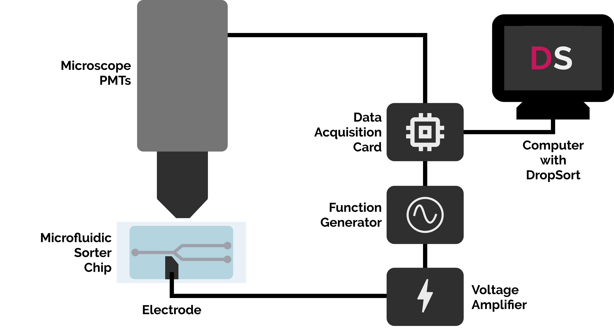
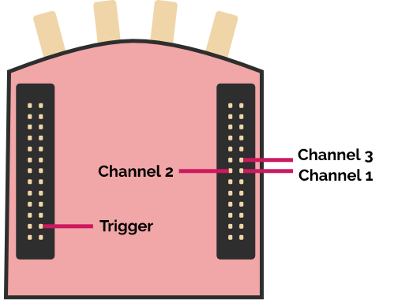

# Setup Guide
This guide will give you a brief overview of the setup procedure required before doing your first sorting experiment with DropSort.

## Hardware setup
DropSort is a software for the processing and analysis of electrical signals generated by a microfluidic droplet sorting setup. For information only, here is an overview of a typical hardware setup of a fluorescence-based microfluidic droplet sorter:

- **Microfluidic system** (including pumps, tubing, and most importantly a droplet sorting microfluidic chip)
- **Optical system** (including a microscope, light sources, and photodetectors such as photo-diodes, photomultiplier tubes etc.)
- **Electrical system** (including a function generator, high-voltage amplifier, and optionnally an oscilloscope)
- **FPGA data acquisition board** DropSort has been designed to run on the RedPitaya STEMlab 125-14, which can be obtained [here](https://www.redpitaya.com/Catalog/p20/stemlab-125-14-starter-kit?cat=c99) (Disclaimer: RedPitaya does not endorse nor support DropSort). We provide custom firmware for it. DropSort has only be tested to work with this FPGA board, please make sure to get the 125MHz 14bit version.
- **How to interface your setup with the FPGA board?** DropSort uses voltage inputs of the FPGA board which support positive voltage signals that must stay below 1.0V. The sorting signal provided by DropSort takes the form of a trigger signal of 40ns at 1.0V via a digital output of the FPGA board. To convert this trigger signal into the sinusoidal wave bursts that are usually required for DEP droplet deflection, an adequate function generator can be connected via its "Trigger" input.

A possible sorter build may look like the schematic below.
   
{: style="width:500px" .center}
   

## Download the software
To obtain a copy of the software, please contact us via the form on the [website](https://dropsort.eu). You will receive an installer for the DropSort software and a software image for the FPGA board.

## Flash the RedPitaya
To install our custom firmware on the FPGA board, please flash the software image (.iso) we provided on an microSD card and insert it into the RedPitaya. Follow installation instructions provided by the [RedPitaya documentation](https://redpitaya.readthedocs.io/en/latest/quickStart/SDcard/SDcard.html), using the software image we provide with the DropSort software instead of the one provided by RedPitaya.

## Wiring
Please wire the FPGA board as follows:
   
{: style="width:500px" .center}
   

WARNING:

- The input voltage of the pins on the FPGA board is 0-1.0V. Please make sure the signals incoming from your photodetectors stay within this range.
