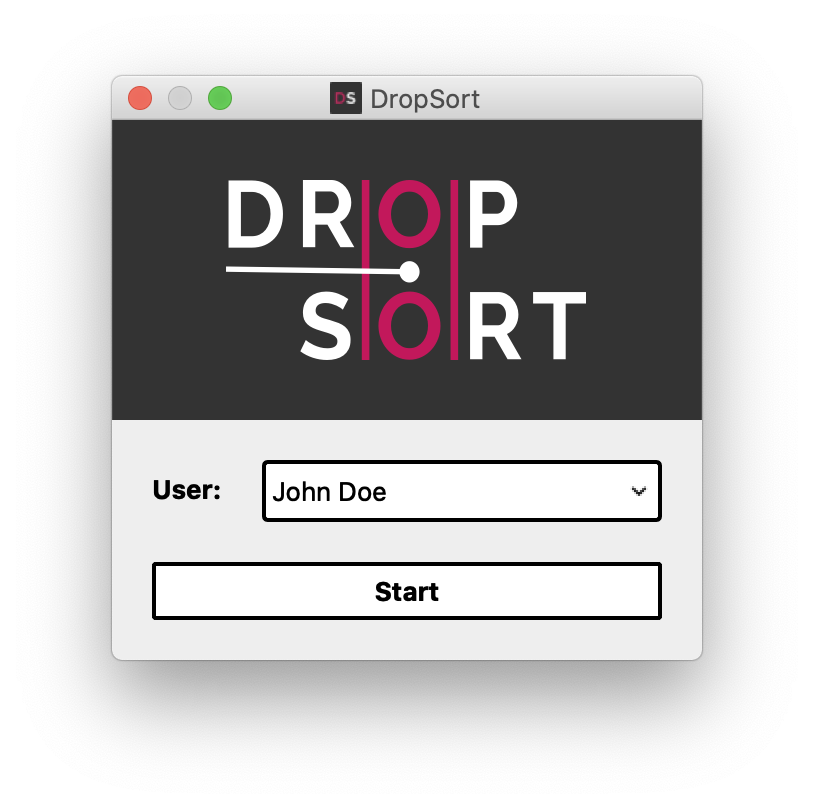
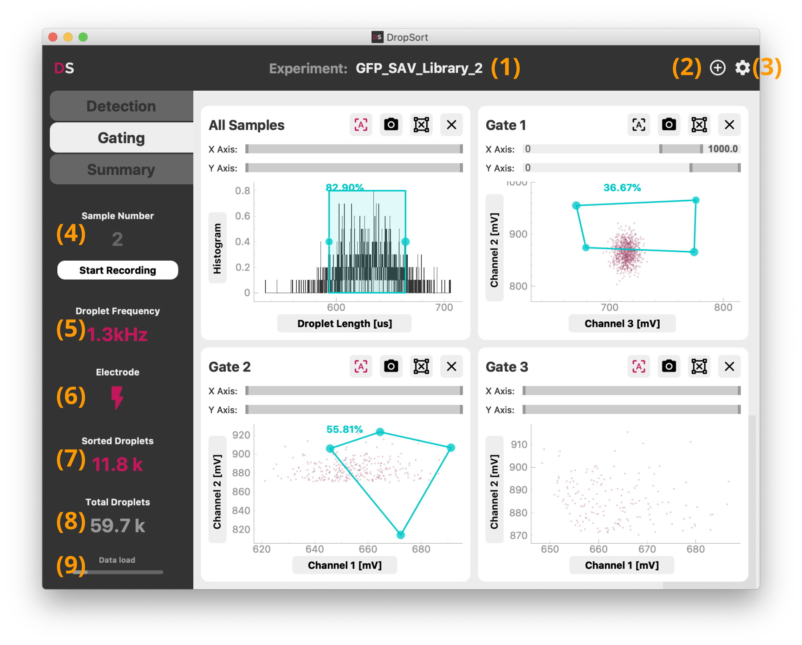
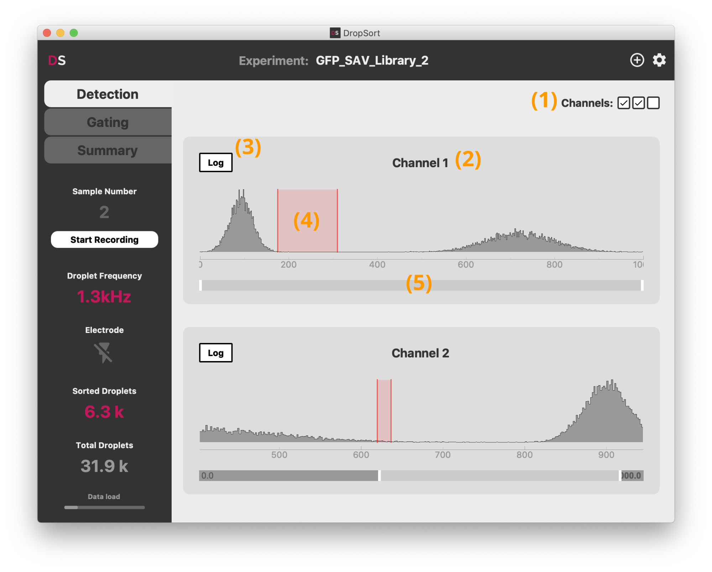
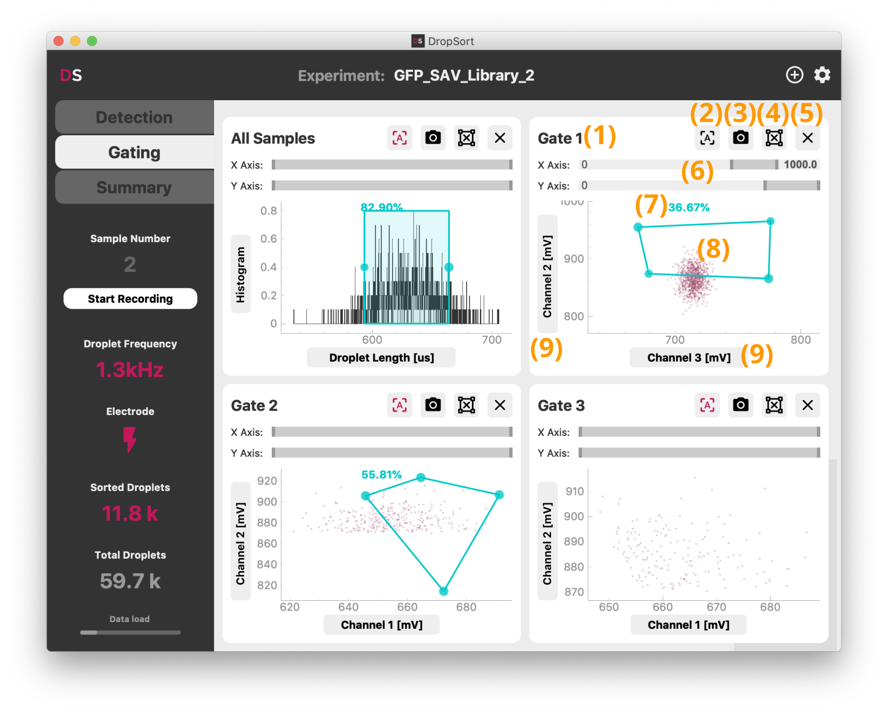
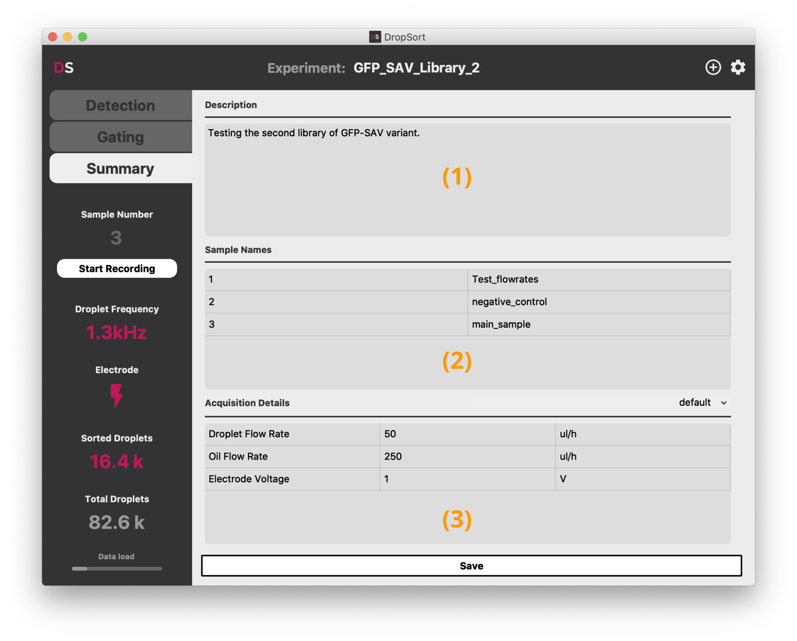
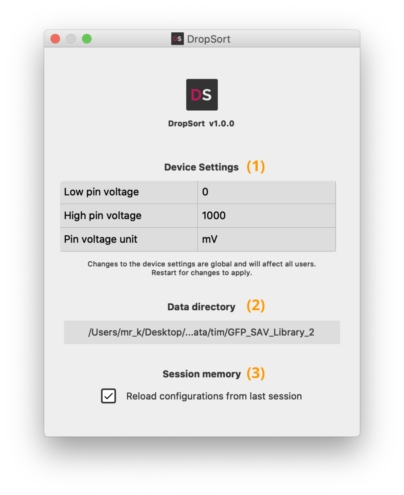

# User Guide

This guide explains the features and usage of DropSort. For instructions on how to set up your device, please refer to the [setup guide](setup.md).

## Introduction
DropSort is a signal processing software intended for the use of a microfluidic droplet sorter. It acquires and processes amplitude-based electrical signals generated by optical detectors (photodiodes, photomultiplier tubes or other detectors), displays detected events in a graphical user interface, and allow you to sort out arbitrary populations of droplets of your choosing. The following sections present the features DropSort offers and demonstrate how to use them.

## Overview of DropSort features

|Features   |Free Version   |Full Version   |
|:-:        |:-:            |:-:            |
|Number of channels|     1          |        3       |
|Detection on one channel|     Yes          |        Yes      |
|Detection on multiple channels|     No         |        Yes      |
|Gating on one channel|     Yes          |        Yes      |
|Gating on droplet length| Yes | Yes |
|Gating on multiple channels|     No          |        Yes      |
|Arbitrary 2D gates|     No          |        Yes      |
|Multiple successive gates|     No          |        Yes      |
|Real time evaluation of pourcentage of gated droplets|     Yes          |        Yes      |
|Instantaneous graph screenshots|     Yes          |        Yes      |
|Droplet data recording|     No          |        Yes      |
|Experiment summary report|     No          |        Yes      |
|User profiles|     No          |        Yes      |

## Start screen

{: style="width:400px" .center}

In the Full Version, the start screen lets you create and/or choose a user profile. Your experimental data will be saved in a personal directory, and ongoing settings such as detection thresholds and gate coordinates will be saved for your next sorting session.

## Main window

{: style="width:800px" .center}

DropSort is organized in three tabs which control respectively the detection thresholds, gating, and data export. The title bar allows to rename **(1)** or to create **(2)** a new experiment. Each experiment data (graph screenshots, raw droplet data records, and experimental summary) will be recorded in a separate folder in your user directory. Next to it, the settings button **(3)** opens device and interface settings (see below).

The side menu shows at all times the current droplet frequency **(5)** and counters **(7,8)** of all and sorted droplets since the start of DropSort. The counters can be reset simply by clicking on them. The "Start Recording" button triggers the recording of droplet raw data for a new sample **(4)** (see below for more details on the data recorded). Stopping the recording will increment the sample number for the next recording. Each sample correspond to separate files, to easily discriminate the different steps and conditions of your experiment.

The lightning symbol **(6)** toggles the activation of the trigger signal sent upon sorting of a droplet. It is disabled on startup to avoid unwanted sorting.

The data load indicator **(9)** at the bottom of the side menu indicates the current filling state of the datastream buffer from the FPGA card to the computer on which you are running DropSort. A full buffer indicates that data is incoming too fast to be processed on time. This should not happen in normal use with a droplet frequency below 10 kHz. In such a case, either increase the computer resources available to DropSort or reduce the sorting speed. Contact us for specific support.

## Droplet detection

{: style="width:800px" .center}

The "Detection" tab shows the distribution of the signal for each channel and the settings of the thresholds above which a droplet is detected. They determine what is recognized as a droplet signal and what is considered background noise. First choose which channel you are going to use for your experiment (Full Version only): you can toggle them with the checkboxes in the top right-hand corner **(1)**. By default channels are simply numbered, but you can change them to custom names by clicking on the channel name **(2)**.

For each channel, the temporal histogram of the signal is plotted. You should generally see one overwhelming mode sitting in the lower values. It corresponds to basal background noise signal, meaning the base signal level measured when no droplet is detected by your optical setup. When detectable droplets modulate the amplitude of the signal, you should see occurences of higher values for your signal, which correspond to data points being sampled inside a droplet. These are the measurement points you are interested in separating from the background noise.

To this end, set the detection threshold **(4)** by clicking into the plot. By clicking once, you set a simple threshold at that value: all signal above the threshold will be detected as a droplet and passed on to the "Gating" tab.

Depending on your experimental setup, and the difference in magnitude between the background noise and the droplets signal, detecting droplets accurately with a simple threshold can be challenging. DropSort therefore implements an optional hysteretic threshold: to be recognized as a droplet, the signal needs to reach a higher threshold, and the droplet ends only once the lower threshold is passed. For this, just click-and-drag over the histogram to set both thresholds. We recommend to always use this type of detection thresholds as it is more robust to noise. Set the lower threshold at the upper limit of the background noise level, and the higher threshold just below the level of the minimum level you expect from your droplets.

You can adapt the detection thresholds at any time during your experiment.

Depending on your experimental setup (droplets signal distribution, droplet frequency, ...), sampled points with a higher level than the noise can be scarce. The logarithmic scale **(3)** can help visualizing your signal in this case. You can also use the range slider **(5)** to zoom into a specific segment of the histogram.

## Droplet sorting

{: style="width:800px" .center}

The "Gating" tab shows the droplet data in real-time and lets you define the conditions of the sorting of your droplets. Each plot contains the subset of droplets that are gated in the previous plot.

In the Full Version, DropSort offers up to 4 gates (1 in the Free Version) **(8)** that can be set by clicking into the gate plot.

First set the droplet features you want to sort on by selecting the signal channels and/or the droplet length in the axis dropdowns **(9)**. If you select "Histogram" on the Y-axis, the plot shows the distribution of the droplets feature you set on the X-axis, and you can gate on this feature by clicking on the plot. It can be particularly useful as a first gate to isolate droplets that fit a certain length criteria that you expect in your experiment.

In 2D scatter plots, you can define any arbitrary 4-point polygon gate, or rectangular gates by pressing the Shift-key while drawing. The percentage displayed **(7)** shows you the amount of droplets that are inside the gate. You can move the gate by click-and-drag, and remove it by clicking the delete buttun **(4)**. To remove the entire plot, click **(5)**. To change the view boundaries of a plot, you can use the range sliders **(6)**, or toggle the autoscale button **(2)**.

For documentation, you can save a screenshot of the plot and its gate by clicking the camera button **(3)**.

## Recorded data

The "Start Recording" button triggers the recording of incoming raw droplet data: maximum voltage value for each channel, droplet length in microseconds, and a binary value indicating whether the droplet was sorted (1) or not (0). 

This data is both recorded in the form of csv and fcs files. The csv files (Comma-separated values files) can easily be processed further with a spreadsheet editor (Excel, Numbers, OpenOffice Calc, ...) or custom scripts using Python, R or other platforms. It can also be openned with a text editor to get a quick look at the values. The fcs files (Flow Cytometry Standard files) can be opened and processed with common FACS data softwares (FlowJo, FCSalyzer, ...).

## Summary report

{: style="width:800px" .center}

The "Summary" tab enables you to write a description **(1)** of your experiment, name the data samples you may have recorded **(2)**, and take note of any parameter **(3)** of your experiments. It is saved alongside the droplet data in the current experiment directory.

You can define your own templates for the acquisition details by clicking on the dropdown above the acquisition details panel.

## Settings

{: style="width:400px" .center}

The settings contain an optional voltage calibration and data saving configurations. You can adapt the calibration and the voltage unit depending on your own experimental setup. **Without calibration, the voltage values measured may not be absolutely accurate.**

You can also change here the general data saving directory **(2)**, or disable the session memory **(3)**.
